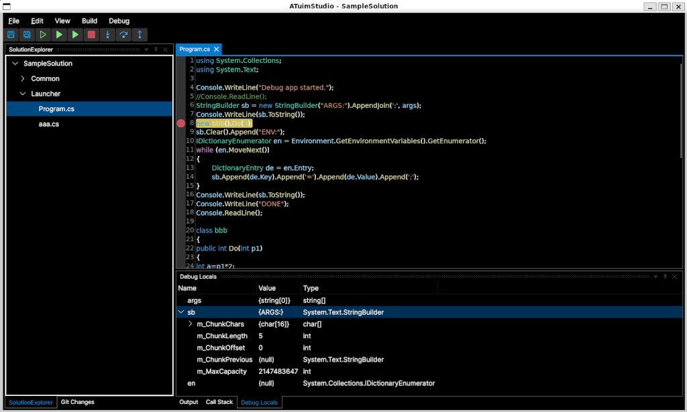

# ATuimStudio 
ATuimStudio is open source multi-platform C#/.NET IDE. Hopefully, it will become as great as a giant turtle one day. Today it contains important built-in extensions to support developer daily tasks:
- C# Editor
- Git client
- MsBuild
- Debugger

### Status
Early development and not recommended for serious work yet. Using this might experience various issues.
Tested on:
- Windows 11
- Ubuntu 24.04.1

### Features:
- Tool and document windows un/docking
- Edit
  - Members recommendations
- Git
  - Multi repo support
  - Stage/Unstage files
  - Undo uncommitted changes
  - Commit/Amend locally
- Build using MsBuild
- Debugger
  - Breakpoints
  - Stepping
  - Call stack view
  - Local variables and parameters view



### Run from code
There's no install package so you have to build it yourself.  
Options are:
1) build using terminal/commands and utilize MsBuild shipped with .NET 10 SDK.
2) simply open the solution from Visual Studio 2026 and build.

ATuimStudio can be started from both command line and VS.

Note: there's unclear issue when starting from VS targetting Linux in WSL2 with connected debugger. That might set `NUGET_FALLBACK_PACKAGES` environment variable incorrectly and a build from ATuimStudio fails.  
Workaround:
1) the easiest way is to add following code right to the app.
```
	string? env = Environment.GetEnvironmentVariable("NUGET_FALLBACK_PACKAGES");
	if (!string.IsNullOrEmpty(env) && env.Contains(':'))
		Environment.SetEnvironmentVariable("NUGET_FALLBACK_PACKAGES", env.Replace(':', ';'));
```
2) however such change is tracked by GIT and that is unwanted in repo. So recommended way is to use code interception.

### Credits / thanks to (in alphabetical order):
- Avalonia - https://github.com/AvaloniaUI/Avalonia
- Avalonia.AvaloniaEdit - https://github.com/avaloniaui/avaloniaedit
- ClrDebug - https://github.com/lordmilko/ClrDebug
- CommunityToolkit.Mvvm - https://github.com/CommunityToolkit/dotnet
- Dock.Avalonia - https://github.com/wieslawsoltes/Dock
- LibGit2Sharp - https://github.com/libgit2/libgit2sharp
- Microsoft .NET - https://github.com/microsoft/dotnet
- Microsoft Build - https://github.com/dotnet/msbuild
- Microsoft CodeAnalysis - https://github.com/dotnet/roslyn
- Microsoft.Diagnostics.DbgShim - https://github.com/dotnet/diagnostics
- Mono:debugger-libs - https://github.com/mono/debugger-libs
- VitalElement.AvalonStudio - https://github.com/VitalElement/AvalonStudio
